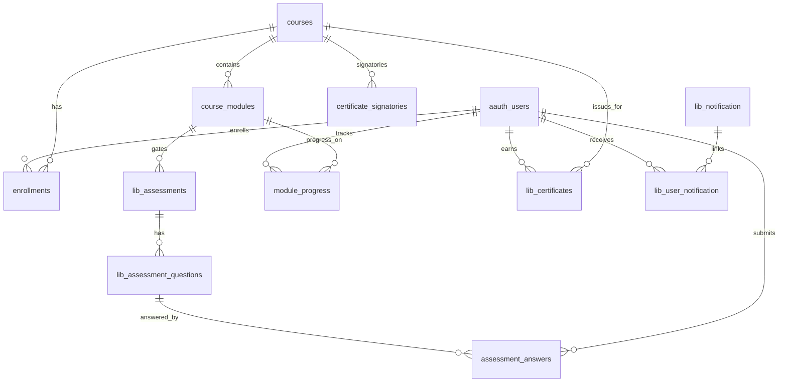

# kaBAGA Academy LMS — Entity Relationship Overview

**Schema source:** `application/sql/db_lms.sql`  
**External:** `application/sql/dbhrmis.sql` (`tblemployee` — read-only)

---

## Core Domains

---

## Identity & Access

| Entity | PK | Key relationships |
|--------|-----|-------------------|
| `aauth_users` | `id` | `employee_id` → HRMIS `tblemployee.idno` |
| `aauth_groups` | `id` | M:N users via `aauth_user_to_group` |
| `aauth_perms` | `id` | M:N groups via `aauth_perm_to_group` |
| `lms_user_access_audit` | `id` | Admin permission changes |
| `activity_logs` | `id` | Platform audit (extended Phase 5) |

---

## Courses & Learning

| Entity | PK | FK |
|--------|-----|-----|
| `courses` | `id` | `modality_id`, `category_id`, `created_by` |
| `course_modules` | `id` | `course_id` |
| `course_module_prerequisites` | `id` | `module_id`, `prerequisite_module_id` |
| `module_progress` | `id` | `user_id`, `module_id` |
| `enrollments` | `id` | `user_id`, `course_id` |
| `course_invitations` | `id` | `course_id`, `user_id` |

---

## Assessments

| Entity | PK | FK |
|--------|-----|-----|
| `lib_assessments` | `id` | `module_id` |
| `lib_assessment_questions` | `id` | `assessment_id` |
| `lib_assessment_choices` | `id` | `question_id` |
| `assessment_answers` | `id` | `question_id`, `user_id` |
| `assessment_attempt_orders` | `id` | `user_id`, `assessment_id` |

---

## Certificates & Notifications

| Entity | PK | FK |
|--------|-----|-----|
| `lib_certificates` | `id` | `user_id`, `course_id` |
| `certificate_signatories` | `id` | `course_id` |
| `lib_certificate_logs` | `id` | `certificate_id` |
| `lib_notification` | `id` | `type_id` |
| `lib_user_notification` | `id` | `notification_id`, `user_id` |
| `notification_email_log` | `id` | `notification_id`, `user_id` |

---

## Configuration

| Entity | Purpose |
|--------|---------|
| `lms_settings` | JSON sections: general, branding, learning, notifications, etd |
| `lib_course_modality` | Online, F2F, HyFlex labels |
| `lib_course_access_type` | open, approval_required, invitation_only |

---

*For column-level FK map see `docs/database_relationships.md`.*
