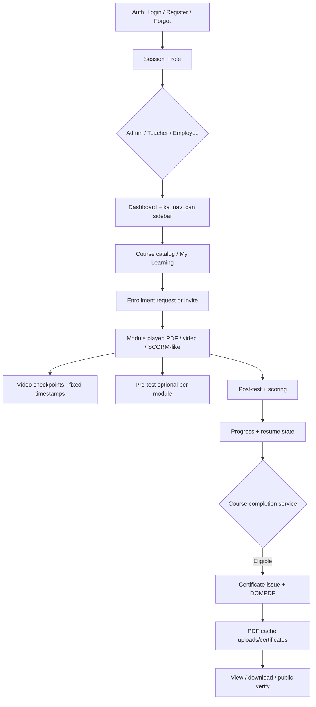

# LMS Presentation Audit — kaBAGA Academy

**Date:** 2026-06-01  
**Purpose:** End-to-end flow review + presentation readiness

---

## A. System flow summary (login → certificate)

### Step-by-step lifecycle

| Step | Flow | Primary components |
|------|------|-------------------|
| 1 | User opens `/auth/login` | `Auth::login`, session CSRF (`auth_csrf_fields`) |
| 2 | Credentials validated | `User_model::login`, lockout, active status |
| 3 | Registration (optional) | HRMIS `check_employee` → `register_process` (no manual fallback) |
| 4 | Forgot password | `forgot_password` → email/token flow |
| 5 | Role + permissions | `aauth_users.role` + Aauth groups/perms (`Permission_model`) |
| 6 | Navigation | `ka_nav_can()` filters sidebar by effective permissions |
| 7 | Browse / enroll | `Courses`, `Enrollments` (approve/reject for managers) |
| 8 | Learn | `Courses::view`, `module.js`, resume via `Progress` / `ka_resume` |
| 9 | Video checkpoints | `Assessments::video_checkpoints` — **admin-set trigger times**, not exam shuffle |
| 10 | Assessments | Pre/post only: optional `randomize_questions` + `assessment_attempt_orders` |
| 11 | Submit / grade | `Assessment_service`, essay grading, retake rules |
| 12 | Completion gate | `Course_completion_service::evaluate_user_course_state` |
| 13 | Certificate | `Certificate_service::generate` → `issue` → DOMPDF template |
| 14 | Delivery | `Certificates::download`, verify URL + QR on PDF |

---

## B. Functional verification

| Module | Status | Notes |
|--------|--------|-------|
| **Login / session** | **PASS** | Custom auth CSRF; remember-me hook; active user guard |
| **Registration (HRMIS)** | **PASS** | Employee ID validation; rate limits; terms panel |
| **Forgot password** | **PASS** | Branded views; CSRF on POST |
| **Permission engine** | **PASS** | Seed manifest; group matrix; user grant/deny; auto-sync on empty DB |
| **Navigation filtering** | **PASS** | `ka_nav_can` on admin menu items when engine active |
| **Middleware** | **RISK** | `Manage_courses` still role-only (`CI_Controller`); assessments use `_require_manager` |
| **Course enrollment** | **PASS** | Requests, invitations, phase2 visibility |
| **Module player** | **PASS** | PDF/video; resume state; ETD phase4 helpers |
| **Video checkpoints** | **PASS** | Randomization only for **auto-distribute trigger seconds** in video bands — **not** exam questions |
| **Pre/post assessments** | **PASS** | Randomization scoped to pre/post via `etd_assessment_randomize_enabled` |
| **Attempt order integrity** | **PASS** | `assessment_attempt_orders` + content version bump |
| **Scoring / retake** | **PASS** | Service layer; result/review views |
| **Progress tracking** | **PASS** | `Course_completion_service`, dashboard progress |
| **Certificate eligibility** | **PASS** | Modules + post-assessment thresholds |
| **DOMPDF generation** | **PASS** | Default template `premium_lcp_certificate`; cached PDF path |
| **Certificate verify** | **PASS** | Public verify route + QR embed |
| **Reports / analytics** | **PASS** | Admin reports + integrity analytics |
| **Libraries admin** | **PASS** | CRUD libraries portal |
| **User management** | **PASS** | Groups + permission tree modal |
| **Branding** | **PASS** | `kaBAGA Academy` across UI + cert defaults |
| **Settings (DB branding)** | **NEEDS IMPROVEMENT** | Existing `lms_settings` rows may still show old name until updated in admin |

---

## C. Presentation notes

### Key strengths

- **Enterprise auth**: HRMIS-linked registration, session hardening, forgot-password flow, remember-me.
- **Structured learning path**: Enroll → modules → checkpoints → pre/post tests → completion → certificate.
- **Assessment integrity**: Question/choice order persisted per attempt; randomization limited to pre/post exams.
- **Completion as a service**: Single `Course_completion_service` drives progress % and certificate eligibility.
- **Professional certificates**: DOMPDF pipeline, multiple templates, verification URL + QR, signatory support.
- **Access control**: Aauth groups, permission matrix UI, effective permission resolution, audit log (with migration).
- **SaaS-ready UI**: Phase 4 design tokens (`ka-saas-ui.css`), library CRUD workspace, user management modal.

### Enterprise features already implemented

| Feature | Highlight |
|---------|-----------|
| ETD / Phase 4 | Learner UX settings, assessment randomize flags |
| Resume learning | Module position saved (`migration_state_resume`) |
| Certificate batches | Phase 3 signatories, multiple PDF templates |
| Integrity analytics | Assessment attempt order dashboard |
| Notifications | Event dispatcher + notification center |
| Reports export | PDF/CSV/Excel analytics |

### Demo script (15 min)

1. Login as admin → show sidebar (Management, Reports, User Management, Group Permissions).
2. Open **Manage Courses** → published course with modules.
3. Switch to employee → **My Learning** → open course → show video/PDF module.
4. Mention checkpoints fire at **fixed times** (instructor-configured).
5. Take or show **post-assessment** → result page.
6. Trigger or show **certificate** download — premium SaaS layout.
7. Open **certificates/verify/{code}** — public verification.
8. Optional: **permissions/groups** matrix — assign role-based access.

### Areas to mention honestly (RISK)

- Some admin controllers still use **role** checks instead of fine-grained permissions (`Manage_courses`).
- **DB-stored** `lms_name` may differ until Settings → General is saved after branding update.
- QR on PDF requires outbound HTTP to QR API at generation time (falls back to placeholder offline).

---

## Part 2 — Certificate premium upgrade (this session)

### Files updated

- `application/views/certificates/templates/premium_lcp_certificate.php`
- `assets/css/certificate_premium.css`
- `scripts/qa_cert_premium.php` (QA render)

### Design improvements

- Clean white canvas, blue accent bar (`#2563EB`), no decorative frames or corner ornaments.
- Header: logo + **kaBAGA Academy** + “Learning Management System” tagline + org name.
- Strong typography: large serif learner name; course title in highlighted card.
- Details panel: completion date, certificate ID, duration, modality, issuing authority.
- Verification block: QR (or placeholder) + verify URL.
- Dual signature blocks preserved (all existing variables/bindings).
- Portrait fallback documented via `.cert-page--portrait` CSS hook.

### DOMPDF test

Run: `php scripts/qa_cert_premium.php`  
Output: `uploads/certificates/_qa_premium_saas.pdf`

### Backend unchanged

- `Certificate_service`, `ka_cert_build_view_data()`, routes, and DB fields are **not** modified.
