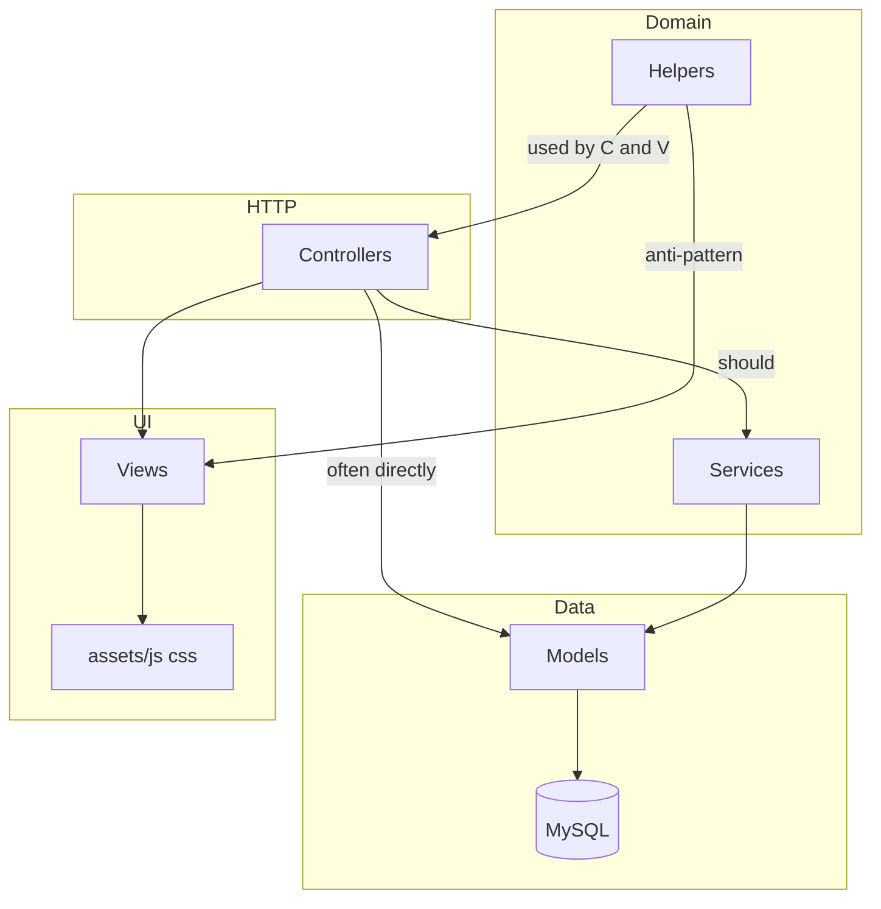

# kaBAGA Academy LMS — MVC Architecture Audit

**Project:** CodeIgniter 3 LMS  
**Scope:** `C:\xampp\htdocs\lms\application` (+ related `assets`, `application/sql`)  
**Date:** 2026-06-08  
**Status:** Read-only audit — **no code changes applied**

---

## Executive Summary

The kaBAGA Academy LMS is a **functional CI3 monolith** with **partial MVC modernization**. Recent work (permissions, certificates, password reset, library CRUD base) shows the **target direction**: thin controllers, `services/` for orchestration, `KA_Controller` for auth/permissions, and registry-driven libraries.

However, **legacy patterns dominate** the largest modules:

| Finding | Severity |
|---------|----------|
| `Assessments.php` (~2,065 lines) mixes HTTP, auth, SQL, grading, checkpoints, and AJAX | **Critical** |
| `course_model.php` (~1,813 lines) and `dashboard_model.php` (~1,421 lines) are god-models | **Critical** |
| **24 of 31 controllers** extend `CI_Controller` and **re-implement auth** instead of `KA_Controller` | **High** |
| `My_courses.php` runs **16+ direct `$this->db` queries** in the controller | **High** |
| Views mostly clean of SQL; **2 views** load models / `get_instance()` for business data | **Medium** |
| Permission engine exists but **most routes still gate on `role` enum** | **High** |
| Services layer started (7 services) but **inconsistently adopted** | **Medium** |
| SQL migrations live in `application/sql/` (no CI `migrations/` folder) | **Low** |

**Overall MVC compliance:** **Partial** — suitable for production with known debt; **not** ready for large feature velocity without refactor.

**Technical Debt Score:** **68 / 100** (higher = more debt)  
**MVC Maturity Grade:** **C+** (improving; Certificates, Permissions, Password Reset on right track)

**Estimated refactor effort (full roadmap):** **8–12 developer-weeks** (phased; not blocking hotfixes)

---

## Phase 1 — Full Architecture Inventory

### 1.1 Layer counts

| Layer | Count | Location |
|-------|------:|----------|
| Controllers | 31 | `application/controllers/` (+ 11 under `libraries/`) |
| Models | 19 | `application/models/` |
| Views | ~149 | `application/views/` |
| Services | 7 | `application/services/` |
| Library shims | 13 | `application/libraries/` (7 are service loaders) |
| Helpers | 14 | `application/helpers/` |
| Core extensions | 2 | `KA_Controller`, `KA_Library_controller` |
| Hooks | 1 | `Remember_session.php` |
| Config (app) | ~20+ | `application/config/` |
| SQL scripts | 25 | `application/sql/` (no `migrations/` folder) |
| Frontend assets | large | `assets/css`, `assets/js`, `assets/tabler`, `assets/img` |

### 1.2 Controllers (line count)

| Controller | Lines | Base class |
|------------|------:|------------|
| Assessments | 2,065 | `CI_Controller` |
| Courses | 973 | `CI_Controller` |
| Manage_courses | 848 | `CI_Controller` |
| Auth | 731 | `CI_Controller` |
| Certificates | 517 | `KA_Controller` |
| Learning_notes | 363 | `CI_Controller` |
| My_courses | 357 | `CI_Controller` |
| Users | 273 | `KA_Controller` |
| libraries/Assessment_choices | 192 | `KA_Controller` |
| Profile | 163 | `CI_Controller` |
| Reports | 166 | `CI_Controller` |
| Assessments (duplicate path) | — | — |
| Dashboard | 136 | `CI_Controller` |
| Notifications | 129 | `KA_Controller` |
| Settings | 127 | `CI_Controller` |
| Error_pages | 125 | `CI_Controller` |
| Enrollments | 122 | `KA_Controller` |
| Permissions | 116 | `KA_Controller` |
| Announcements | 90 | `CI_Controller` |
| Libraries_portal | 28 | `KA_Controller` |
| Progress | 28 | `KA_Controller` |
| Welcome | 23 | `CI_Controller` |
| PdfTest | 15 | `CI_Controller` |
| 10× `libraries/Lib_*` | ~6 each | `KA_Library_controller` |

### 1.3 Models (line count)

| Model | Lines | Notes |
|-------|------:|-------|
| course_model | 1,813 | Enrollment, modules, completion, certificates |
| assessment_model | 1,769 | Assessments + attempts |
| dashboard_model | 1,421 | Aggregations + loads services |
| Course_phase2_model | 1,411 | Phase 2 course features |
| certificate_model | 678 | Issuance, PDF paths, signatories |
| Module_video_checkpoint_model | 670 | Video checkpoints |
| Reports_model | 668 | Report queries |
| User_access_model | 559 | Permission matrix UI |
| notification_model | 458 | In-app notifications |
| Learning_notes_model | 436 | Notes CRUD |
| Profile_model | 421 | Profile fields |
| Assessment_integrity_model | 383 | Proctoring / integrity |
| user_model | 337 | Auth, HRMIS, registration |
| Library_crud_model | 333 | Generic library CRUD |
| Settings_model | 315 | Platform settings KV |
| Assessment_choice_model | 224 | Question choices |
| Permission_model | 188 | Effective permissions |
| Assessment_attempt_order_model | 189 | Randomization order |

### 1.4 Services

| Service | Role |
|---------|------|
| `Assessment_service` | Assessment take/submit/grade orchestration |
| `Assessment_integrity_service` | Integrity rules during attempts |
| `Certificate_service` | PDF generation, issuance gate |
| `Course_completion_service` | Completion eligibility, module progress |
| `Notification_service` | In-app + email event dispatch |
| `Password_reset_service` | Token reset flow (recent) |
| `User_access_service` | User/group access tree sync |

Each has a matching `application/libraries/*_service.php` shim for CI loader.

### 1.5 Helpers (selected)

| Helper | Lines (approx) | Role |
|--------|----------------|------|
| certificate_pdf_helper | ~456 | Template resolution, PDF view data, QR |
| etd_phase4_helper | ~320 | ETD/F2F UI + branding settings |
| permission_helper | ~132 | Nav gating, `ka_user_can()` |
| report_export_helper | ~97 | DOMPDF autoload, export logging |
| ka_layout_helper | — | Layout data, flash, branding |
| registration_helper | — | Employee ID normalization |
| library_crud_helper | — | Library registry UI |
| course_phase2/3_helper | — | Phase feature flags |

### 1.6 View directories

| Directory | ~Files | Primary domain |
|-----------|-------:|----------------|
| assessments/ | 15+ | Take, grade, checkpoints |
| manage_courses/ | 20+ | Course workspace (phase2/3 partials) |
| libraries/ | 15+ | Admin lookup CRUD |
| certificates/ | 10+ | List, view, PDF templates |
| courses/ | 8+ | Catalog, module player |
| my_courses/ | 6+ | Role dashboards |
| settings/ | 12+ | Platform settings tabs |
| auth/ | 6 | Login, register, forgot, reset |
| layouts/ | 5 | main, sidebar, navbar |
| reports/ | 5+ | Analytics, export |
| administrator/ | 3+ | Users, permissions |
| dashboard/ | 3 | Role dashboards |
| profile/ | 5 | Account tabs |
| components/ | 8+ | Reusable partials |

### 1.7 Architecture relationship diagram



**Healthy path:** `Controller → Service → Model → DB → View`  
**Common path today:** `Controller → Model → DB` and `Controller → View` with helpers + inline role logic

---

## Phase 2 — MVC Compliance Matrix

### 2.1 Rule-based scan results

| # | Rule | Result | Evidence |
|---|------|--------|----------|
| 1 | DB queries in views | **PASS** | No `$this->db` in `application/views/` |
| 2 | Business logic in views | **FAIL** | `libraries/crud/listview.php` loads model; `courses/module.php` reads session flash via `get_instance()`; role branching in `announcements/index.php`, `sidebar.php` |
| 3 | Controllers >500 lines | **WARNING** | 5 controllers exceed threshold (see §1.2) |
| 4 | Controllers with direct SQL | **FAIL** | `My_courses`, `Assessments`, `Users`, `Permissions`, `Manage_courses`, `Auth`, `Courses` |
| 5 | Duplicate business logic | **FAIL** | Auth guard duplicated in 10+ controllers; enrollment logic split across `Courses`, `My_courses`, `Enrollments` |
| 6 | Models generating HTML | **WARNING** | `notification_model` embeds `<strong>` in message strings |
| 7 | Helpers with business rules | **WARNING** | `certificate_pdf_helper` (settings, templates, QR fetch); `permission_helper` (nav policy); `etd_phase4_helper` |
| 8 | Services that should be models | **PASS** | Services are orchestration-appropriate |
| 9 | Models exceeding SRP | **WARNING** | `course_model`, `dashboard_model`, `assessment_model`, `Course_phase2_model` |
| 10 | Dead code | **WARNING** | `PdfTest`, `Welcome`, `auth/loginbk.php`, duplicate Windows path entries |
| 11 | Unused controllers | **WARNING** | `PdfTest` (dev only), `Welcome` (CI default) |
| 12 | Duplicate libraries | **WARNING** | 7 service shims mirror `services/` (intentional CI pattern) |

### 2.2 Layer compliance summary

| Layer | PASS | WARNING | FAIL |
|-------|-----:|--------:|-----:|
| Controllers | 8 | 12 | 11 |
| Models | 6 | 10 | 3 |
| Views | ~130 | ~15 | 3 |
| Services | 7 | 0 | 0 |
| Helpers | 6 | 6 | 2 |
| Libraries | 5 | 8 | 0 |

---

## Phase 3 — Controller Review

| Controller | Current responsibility | Issues | Recommendation |
|------------|------------------------|--------|----------------|
| **Assessments** | Full assessment lifecycle + checkpoints + AJAX API | 2K lines; own auth; direct DB; no `require_permission` | **Split:** `Assessments`, `Assessment_checkpoints` (API), `Assessment_grading`; extend `KA_Controller`; move logic to `Assessment_service` |
| **Courses** | Catalog, module player, completion, enrollment hooks | 973 lines; direct DB; `CI_Controller` | **Service:** `Course_player_service`, `Enrollment_service`; extend `KA_Controller` |
| **Manage_courses** | Course CRUD, phase2/3 workspace | 848 lines; role checks; some direct DB | Keep controller; extract `Course_admin_service`; partials already good |
| **Auth** | Login, register, forgot/reset, HRMIS check | 731 lines; one direct DB on register; justified `CI_Controller` | **Split:** `Auth` + `Registration_service` (exists logic inline); keep public routes on `CI_Controller` |
| **Certificates** | List, view, PDF, verify, regenerate | Good `KA_Controller` usage; some `role === teacher` | **Move** teacher scope checks to `Certificate_policy_service` |
| **My_courses** | Role dashboards + catalog queries | **16 direct DB calls** | **FAIL →** new `My_courses_model` or extend `course_model` queries; extend `KA_Controller` |
| **Dashboard** | Role-based home | Duplicated auth vs `KA_Controller` | Extend `KA_Controller`; use `Dashboard_service` |
| **Reports** | Analytics + export | Role checks; export via library OK | Extend `KA_Controller`; `require_permission('reports.view')` everywhere |
| **Settings** | Platform settings tabs | Admin role only; no permission keys | Extend `KA_Controller`; `settings.manage` permission |
| **Users** | User list + access modal | Good permission guard | **Keep**; move direct `aauth_*` queries to `User_access_model` |
| **Permissions** | Group matrix | Good | **Keep** |
| **Enrollments** | Approve/reject | `KA_Controller` | **Keep**; consolidate with `Courses` enrollment |
| **Learning_notes** | Notes CRUD + API | `CI_Controller`; admin role in controller | Extend `KA_Controller`; permission `notes.manage` |
| **Profile** | User profile tabs | `CI_Controller` | Extend `KA_Controller` |
| **Notifications** | In-app feed | `KA_Controller` | **Keep** |
| **Announcements** | Announcements | Role logic in view + controller | `Announcement_service` |
| **Libraries_portal** | Library hub | `KA_Controller` + permission | **Keep** |
| **libraries/Lib_*** (10) | Registry CRUD | Thin `KA_Library_controller` children | **Exemplar** — replicate pattern |
| **libraries/Assessment_choices** | Custom library CRUD | Slightly larger | **Keep** |
| **PdfTest** | DOMPDF smoke test | Dev artifact, no auth | **Remove** or gate `ENVIRONMENT !== production` |
| **Welcome** | CI scaffold | Unused | **Remove** or redirect to login |
| **Error_pages** | Custom errors | Public `CI_Controller` OK | **Keep** |
| **Progress** | Progress API stub | Thin `KA_Controller` | **Keep** or merge into `Courses` |

---

## Phase 4 — Model Review

| Model | Verdict | Recommendation |
|-------|---------|----------------|
| course_model | **Split** | Extract: `Enrollment_model`, `Module_model`, `Course_completion_model` (queries only); keep facade or deprecate gradually |
| assessment_model | **Split** | Extract: `Assessment_attempt_model`, `Assessment_question_model` |
| dashboard_model | **Split** | Move aggregations to `Dashboard_read_model` or `Reports_model`; remove service loading from model |
| Course_phase2_model | **Merge/Split** | Overlaps `course_model`; consolidate phase2 into domain services |
| certificate_model | **Keep** | Reasonable; PDF path logic could move to service only |
| user_model | **Keep** | Auth + HRMIS OK; password reset DB methods recently added — OK |
| Permission_model | **Keep** | Single responsibility |
| User_access_model | **Keep** | Matrix queries belong here |
| notification_model | **Keep** | Remove HTML from message builders → plain text + view formatting |
| Reports_model | **Keep** | Large but cohesive |
| Module_video_checkpoint_model | **Keep** | Cohesive |
| Settings_model | **Keep** | KV settings |
| Library_crud_model | **Keep** | Generic CRUD exemplar |
| Learning_notes_model | **Keep** | |
| Profile_model | **Keep** | |
| Assessment_* (integrity, choice, order) | **Keep** | |

**Anti-pattern:** Models loading libraries (`course_model`, `dashboard_model`, `certificate_model` load `course_completion_service`). **Move** completion evaluation to services calling models.

---

## Phase 5 — View Review

### 5.1 PASS (majority)

Most views are **presentation-only**: HTML, Tabler classes, escaped output, controller-prepared variables.

### 5.2 FAIL — violations

| File | Violation | Fix |
|------|-----------|-----|
| `views/libraries/crud/listview.php` | `get_instance()` + `load->model('Library_crud_model')` + `is_archived_row()` in view | Controller prepares `is_archived` per row |
| `views/courses/module.php` | `get_instance()` + session flash parsing for pre-assessment modal | Controller builds `$module_pre_modal` |

### 5.3 WARNING — violations

| File | Violation | Fix |
|------|-----------|-----|
| `views/layouts/sidebar.php` | Mixed `$user_role === 'admin'` **and** `ka_nav_can()` | Pass `$nav_items` from controller/helper only |
| `views/announcements/index.php` | Role-based query/display logic at top of view | Controller passes filtered list |
| `views/manage_courses/*.php` | `$is_admin = $user_role === 'admin'` | Pass `$can_edit` booleans from controller |
| `views/assessments/create.php` | Role-based empty-state copy | Pass `$empty_state_message` |
| `views/certificates/template_pdf.php` | Large inline PHP for certificate layout | Acceptable for PDF; consider view + minimal vars only |
| `views/auth/register_modal.php` | Standalone full HTML page (not partial) | Naming/structure only |

### 5.4 Views should NOT (checklist)

| Check | Status |
|-------|--------|
| Database queries | **PASS** (no `$this->db`) |
| Model loading | **FAIL** (1 file) |
| Permission calculations | **WARNING** (sidebar, announcements) |
| Complex PHP logic | **WARNING** (module.php flash, certificate templates) |

---

## Phase 6 — Permission System Review

### 6.1 Tables (from `db_lms.sql` + migrations)

| Table | Used | Notes |
|-------|------|-------|
| aauth_users | Yes | `role` enum still used widely |
| aauth_groups | Yes | |
| aauth_perms | Yes | Named permissions |
| aauth_perm_to_group | Yes | |
| aauth_perm_to_user | Yes | Grants |
| aauth_perm_deny_to_user | Yes | Denials (migration) |
| aauth_perm_module_main/sub | Yes | Matrix UI |

### 6.2 Enforcement

| Layer | Enforced? | Notes |
|-------|-----------|-------|
| **KA_Controller** | Yes | `require_permission()`, `user_can()` |
| **Controllers on KA_Controller** | Partial | Only Users, Permissions, Certificates, Enrollments, Notifications, Libraries, Progress, Assessment_choices |
| **Controllers on CI_Controller** | Mostly **role-only** or manual session | Assessments, Courses, Manage_courses, Dashboard, Reports, Settings, etc. |
| **Navigation** | Partial | `ka_nav_can()` in sidebar; still mixed with `$user_role === 'admin'` |
| **Duplication** | Yes | Role checks in controller **and** view **and** nav |

### 6.3 Bypass risks

1. **`require_permission` fallback:** When engine inactive, non-admins blocked only if `require_permission` called; many controllers never call it.
2. **Direct URL access:** Employee hitting `/manage_courses` may rely on controller role check — inconsistent.
3. **Teacher vs instructor:** Enum inconsistency (`teacher` in LMS, `instructor` in some guards).

### 6.4 Recommendations

1. Migrate **all authenticated controllers** to `KA_Controller` (except `Auth`, `Error_pages`).
2. Replace `require_role('admin')` with manifest permissions (`lms_permissions.php`).
3. Remove duplicate `$user_role ===` from views; use `$user_can_*` flags from controller.
4. Add middleware-style hook or base method `require_route_permission()` mapped from URI.
5. See also: `docs/PERMISSION_SYSTEM_AUDIT.md` (2026-06-01).

---

## Phase 7 — LMS Workflow Review

| Workflow | MVC compliance | Notes |
|----------|----------------|-------|
| **Login** | PASS | Auth controller + user_model |
| **Registration** | WARNING | Auth heavy; HRMIS in model OK; CSRF custom |
| **Forgot password** | PASS | Recent: `Password_reset_service` + model + thin controller |
| **Dashboard** | WARNING | Duplicated auth; fat dashboard_model |
| **Course enrollment** | FAIL | Split across Courses, My_courses, Enrollments; SQL in My_courses |
| **Learning module** | WARNING | courses/module view has session logic; Courses controller large |
| **Video checkpoints** | FAIL | Embedded in Assessments controller (2K lines) |
| **Assessments** | FAIL | God controller + god model |
| **Certificates** | PASS | Service + helper + KA_Controller |
| **Reports** | WARNING | Reports_model OK; controller role-only |
| **User management** | PASS | KA_Controller + Permissions |
| **Libraries** | PASS | KA_Library_controller pattern |
| **Permissions** | PASS | Seed service + matrix UI |
| **Settings** | WARNING | No permission keys; CI_Controller |
| **Notifications** | PASS | KA_Controller + service |
| **Learning notes** | WARNING | CI_Controller |
| **Profile** | WARNING | CI_Controller |

---

## Phase 8 — Refactor Roadmap

### Priority 1 — Critical (security / maintainability)

| # | File(s) | Problem | Risk | Recommendation |
|---|---------|---------|------|----------------|
| P1-1 | `My_courses.php` | 16+ direct DB queries in controller | Bugs, untestable, SQL injection surface if extended poorly | Create `My_courses_model`; controller → service |
| P1-2 | `Assessments.php` | 2,065-line god controller | Cannot safely extend; merge conflicts | Split into 3 controllers + expand `Assessment_service` |
| P1-3 | 24 controllers | No `KA_Controller` — duplicated auth | Session bypass inconsistencies | Migrate to `KA_Controller` |
| P1-4 | Most controllers | `role` checks bypass permission engine | Unauthorized access if role wrong | `require_permission()` per route |
| P1-5 | `libraries/crud/listview.php` | Model in view | MVC break | Precompute rows in `KA_Library_controller` |

**Effort:** ~3–4 weeks

### Priority 2 — Important (structure / velocity)

| # | File(s) | Problem | Risk | Recommendation |
|---|---------|---------|------|----------------|
| P2-1 | `course_model.php` | 1,813 lines, loads services | Circular deps, slow onboarding | Domain split + `Course_service` facade |
| P2-2 | `dashboard_model.php` | 1,421 lines + service calls | Same | `Dashboard_query_model` + thin service |
| P2-3 | `Courses.php`, `Manage_courses.php` | 800–970 lines | Feature drag | Extract services per use-case |
| P2-4 | `courses/module.php` | Session flash logic in view | Hard to test player states | Controller prepares modal DTO |
| P2-5 | `sidebar.php` | Role + permission mix | Nav drift | Single `Nav_builder_service` |
| P2-6 | `notification_model` | HTML in messages | XSS / double encoding | Plain text in DB; format in view |
| P2-7 | `certificate_pdf_helper` | Settings + render + QR HTTP | Helper god-file | Split: `Certificate_template_service` |

**Effort:** ~3–4 weeks

### Priority 3 — Technical debt

| # | File(s) | Problem | Risk | Recommendation |
|---|---------|---------|------|----------------|
| P3-1 | `PdfTest.php`, `Welcome.php` | Dead/dev endpoints | Attack surface | Remove or env-gate |
| P3-2 | `auth/loginbk.php` | Unused backup view | Confusion | Delete |
| P3-3 | `application/sql/` vs `migrations/` | No CI migration runner | Deploy drift | Introduce CI migrations wrapping SQL |
| P3-4 | Service library shims (×7) | Duplication | Low — idiomatic CI3 | Document pattern; optional PSR-4 later |
| P3-5 | `Course_phase2_model` | Overlaps course_model | Duplicate queries | Merge plan |
| P3-6 | Naming inconsistency | `teacher` vs `instructor` | Logic bugs | Enum normalization migration |

**Effort:** ~1–2 weeks

---

## Phase 9 — Target Architecture

### 9.1 Recommended folder layout

```
application/
├── controllers/          # Thin: HTTP, validation, redirect, JSON status
│   ├── Auth.php          # Public auth only (CI_Controller)
│   ├── Dashboard.php
│   ├── Courses.php
│   ├── Assessments/
│   │   ├── Assessments.php
│   │   ├── Checkpoints.php      # JSON API
│   │   └── Grading.php
│   └── libraries/        # KA_Library_controller children (keep)
├── models/               # DB only: queries, inserts, updates, no HTML
│   ├── User_model.php
│   ├── Course_model.php
│   ├── Enrollment_model.php   # (split from course_model)
│   └── ...
├── services/             # Business orchestration, transactions, policies
│   ├── Auth/
│   │   ├── Registration_service.php
│   │   └── Password_reset_service.php   # exists
│   ├── Learning/
│   │   ├── Course_player_service.php
│   │   ├── Course_completion_service.php
│   │   └── Enrollment_service.php
│   ├── Assessment_service.php
│   ├── Certificate_service.php
│   ├── Notification_service.php
│   ├── Permission_service.php         # seed + effective checks wrapper
│   └── Nav_builder_service.php
├── repositories/         # (optional phase 2) complex read queries / reports
│   ├── Dashboard_repository.php
│   └── Reports_repository.php
├── views/                # HTML + minimal presentation PHP
├── libraries/            # CI adapters: Pdf, Email, Reports_export, service shims
├── helpers/              # Pure functions: format, url, escape — NO DB
├── hooks/                # Remember_session; future: permission route hook
├── migrations/           # NEW: versioned schema from application/sql
└── config/
    ├── lms_permissions.php
    └── library_registry.php
```

### 9.2 Where major components should live

| Domain | Controller | Service | Model(s) | Views |
|--------|------------|---------|----------|-------|
| Auth | Auth | Password_reset, Registration | user_model | auth/* |
| Dashboard | Dashboard | Dashboard_service | dashboard queries model | dashboard/* |
| Courses / player | Courses | Course_player, Completion | course, module | courses/* |
| Enrollment | Enrollments | Enrollment_service | enrollment (split) | my_courses/* |
| Assessments | Assessments/* | Assessment, Integrity | assessment_* | assessments/* |
| Certificates | Certificates | Certificate | certificate | certificates/* |
| Reports | Reports | (Reports_export lib) | Reports_model | reports/* |
| Users / access | Users | User_access | User_access, Permission | administrator/* |
| Permissions | Permissions | Permission_seed | Permission | administrator/permissions/* |
| Libraries | libraries/* | — | Library_crud | libraries/* |
| Settings | Settings | — | Settings_model | settings/* |
| Notifications | Notifications | Notification | notification | (components) |

### 9.3 Controller responsibility template

```php
// Target pattern
public function action() {
    $this->require_permission('domain.action');
    $result = $this->domain_service->doThing($input);
    if (!$result['ok']) { return $this->flash_and_redirect(...); }
    return $this->render('view', $result['data']);
}
```

---

## Technical Debt Score — Methodology

| Category | Weight | Score (0–10 debt) | Weighted |
|----------|--------|-------------------|----------|
| Controller size/complexity | 25% | 8.5 | 2.13 |
| Model SRP | 20% | 7.5 | 1.50 |
| View purity | 15% | 3.0 | 0.45 |
| Service adoption | 15% | 5.0 | 0.75 |
| Permission consistency | 15% | 7.0 | 1.05 |
| Dead code / duplication | 10% | 5.0 | 0.50 |
| **Total** | 100% | — | **6.38 → 68/100** |

---

## Estimated Effort Summary

| Phase | Scope | Effort |
|-------|-------|--------|
| P1 Critical | Auth base, My_courses SQL, Assessments split start, view model fix | 3–4 weeks |
| P2 Important | God model splits, Courses/Manage refactor, nav builder | 3–4 weeks |
| P3 Debt | Cleanup, migrations, naming | 1–2 weeks |
| **Total** | Full roadmap | **8–12 weeks** (1 dev, phased) |

**Suggested order:** P1-3 (KA_Controller migration) → P1-1 (My_courses) → P1-4 (permissions) → P1-2 (Assessments split) → P2 god models → P3 cleanup.

---

## Approval Gate

This document is **audit-only**. No application code was modified.

**Next step:** Review and approve priority scope (P1 only vs full roadmap). After approval, implement in small PRs per module to avoid regression.

---

## Appendix A — Controllers extending KA_Controller (today)

| Extends KA_Controller | Extends CI_Controller |
|-----------------------|------------------------|
| Certificates, Users, Permissions, Enrollments, Notifications, Libraries_portal, Progress, Assessment_choices, 10× Lib_* | Auth, Assessments, Courses, Manage_courses, My_courses, Dashboard, Reports, Settings, Profile, Learning_notes, Announcements, Error_pages, Welcome, PdfTest |

**Ratio:** 8 domain + 10 library = **18 / 31** on base controller (~58%)

---

## Appendix B — Related existing docs

- `docs/PERMISSION_SYSTEM_AUDIT.md`
- `docs/USER_ACCESS_MANAGEMENT.md`
- `docs/LIBRARY_SYSTEM.md`
- `docs/REGISTRATION_HARDENING.md`

---

*End of MVC Architecture Audit*
