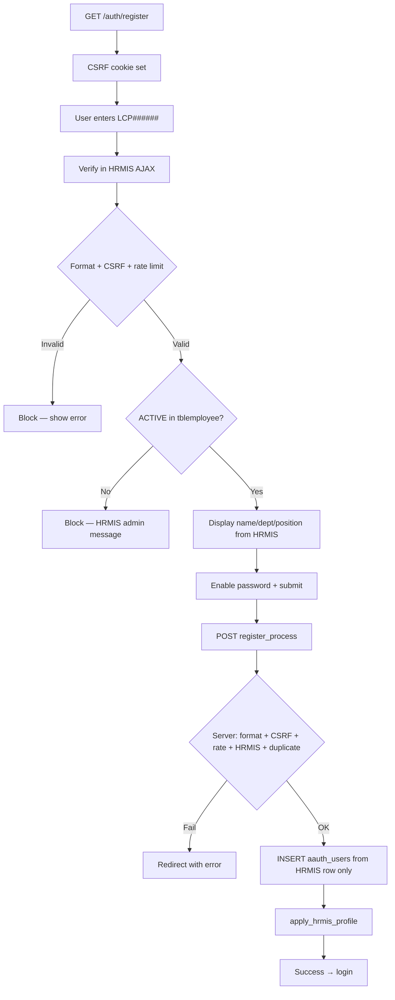

# Registration Hardening — HRMIS Enforcement

## Updated registration flow



## Rules enforced

| Rule | Implementation |
|------|----------------|
| Format `^LCP[0-9]{6}$` | `registration_helper.php`, `valid_lcp_employee_id` callback |
| Uppercase + trim | `normalize_employee_id()` |
| HRMIS ACTIVE only | `User_model::get_hrmis_employee()` |
| No manual fallback | Removed LMS01 path from `Auth::register_process` |
| Identity from HRMIS | `build_registration_row_from_hrmis()` |
| CSRF | `verify_post_csrf()` / `verify_post_csrf_ajax()` on auth POST |
| Rate limit | Session buckets: check_employee (15/10min), register (5/10min) |
| Unique employee_id | `migration_registration_hardening.sql` (run after dedup audit) |

## HRMIS query

```sql
SELECT * FROM tblemployee WHERE idno = ? AND status = 'ACTIVE' LIMIT 1;
```

## Files modified

- `application/controllers/Auth.php`
- `application/models/User_model.php`
- `application/views/auth/register_modal.php`
- `application/helpers/registration_helper.php` (new)
- `application/config/routes.php`
- `application/sql/migration_registration_hardening.sql` (new)
- `docs/REGISTRATION_HARDENING.md` (this file)

## External users (future)

Not implemented. Use a separate controller/role (`external`) — do not mix with employee registration.
