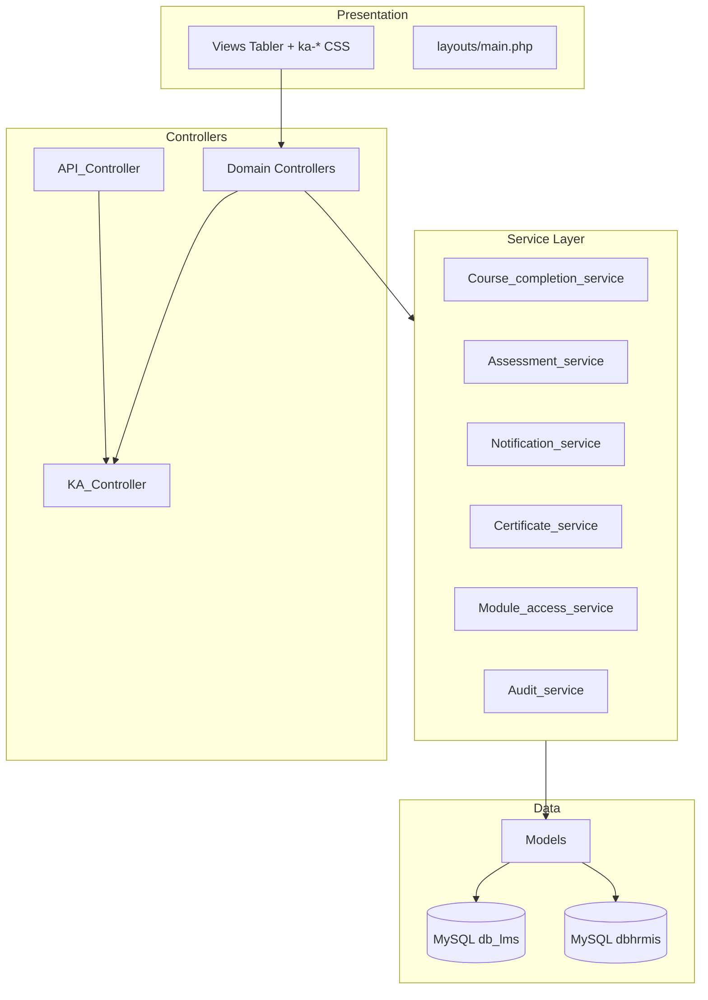
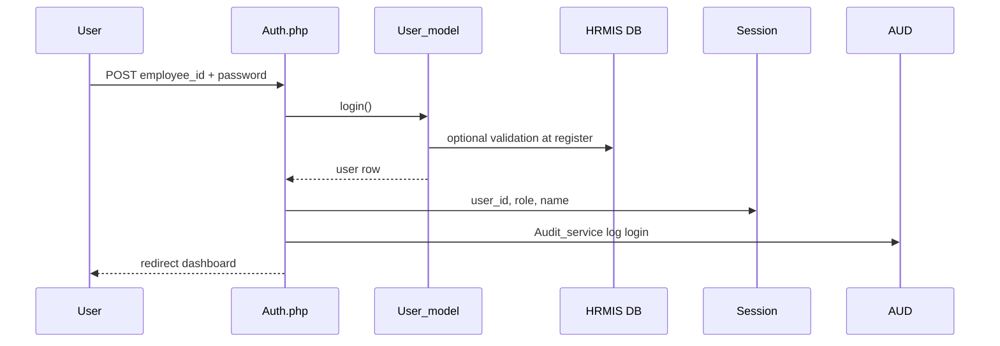
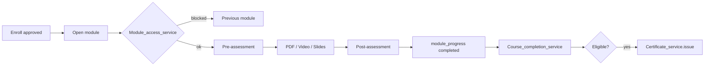
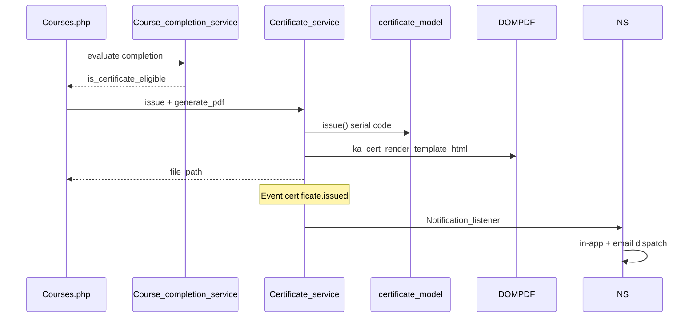

# kaBAGA Academy LMS — System Architecture

**Framework:** CodeIgniter 3 · **UI:** Tabler + kaBAGA tokens · **Pattern:** MVC + Services

---

## Layer Diagram

---

## Authentication Flow

**Session guard:** `KA_Controller::_boot_auth()` on all authenticated pages.

**Permissions:** `Permission_model` + `require_permission()`; legacy `role` fallback when engine inactive or user has no groups.

---

## Course Completion Flow

**Single source:** `Course_completion_service::evaluate_user_course_state()`  
**CTA:** `get_course_cta()` in `course_cta_helper.php`

---

## Certificate Flow

---

## Event Architecture

| Event | Dispatcher | Listener |
|-------|------------|----------|
| `course.completed` | Courses | `Notification_listener` |
| `enrollment.approved` | Enrollments | `Notification_listener` |
| `certificate.issued` | Certificates | `Notification_listener` |

**Config:** `application/config/event_listeners.php`  
**Email side-effect:** `Notification_service::afterNotificationCreated()` → `Email_service` + `notification_email_log`

---

## API (v1 foundation)

| Route | Controller | Auth |
|-------|------------|------|
| `GET api/v1/courses` | `Api_v1/Courses` | Session + `courses.view` |
| `GET api/v1/courses/{id}` | `Api_v1/Courses::show` | Session + `courses.view` |

**Base:** `application/core/API_Controller.php` extends `KA_Controller`

---

## Key Single Sources of Truth

| Domain | Authority |
|--------|-----------|
| Branding | `ka_branding_settings()` |
| Pass threshold | `ka_assessment_pass_threshold($course_id, $assessment_id)` |
| Module access | `Module_access_service::can_access_module()` |
| Notification email | `User_model::resolve_notification_email()` |
| Certificate PDF | `certificate_pdf_helper.php` |

---

*Companion: `docs/MVC_ARCHITECTURE_AUDIT.md`, `docs/PERMISSION_SYSTEM_AUDIT.md`*
